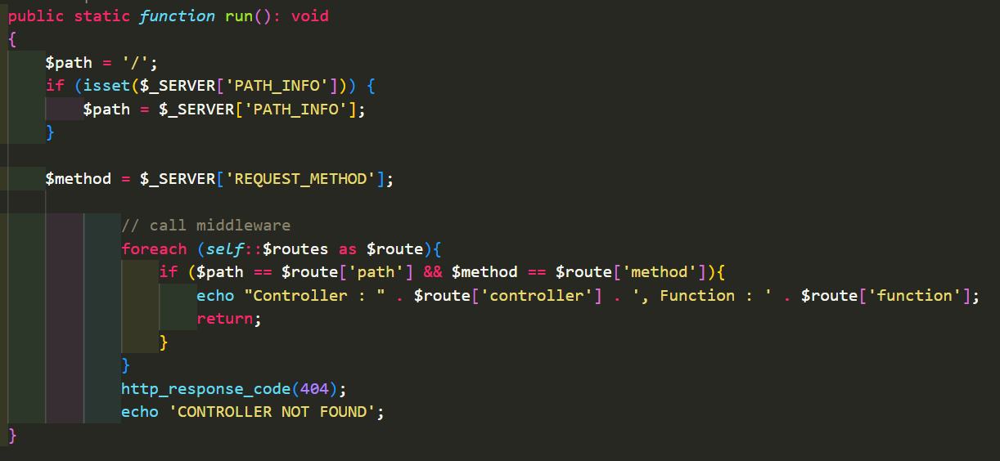
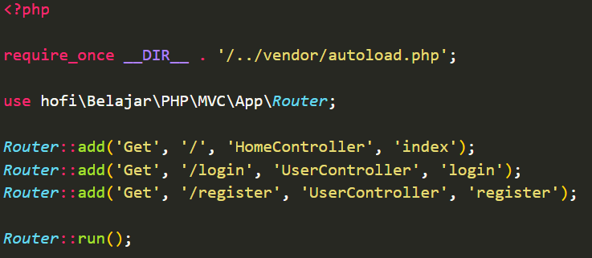

# PHP MVC (Model View Controller)

## A. POINT UTAMA

### 1. Sejaha MVC

- MVC singkatan dari `Model View Controller`, yaitu salah satu software design pattern yang banyak digunakan ketika pengembangan aplikasi berbasi interface.

- MVC pertama kali diperkenalkan oleh _Trygve Reenskaug_ pada tahun _1970_.

- Konsep MVC terbagi menjadi tiga bagian: model, view, dan controller.

  1. Model: Menyimpan data dan logika bisnis.

  2. View: Menampilkan informasi kepada pengguna.

  3. Controller: Mengatur interaksi antara Model dan View.

- Diagram MVC

  

---

### 2. Membuat Project

- Dependency

  

- Struktur project

  

---

### 3. Public Directory

- Best practice ketika membuat web dengan PHP adalah kita tidak mengekspos seluruh kode PHP kita.

- Biasanya kita akan membuat _directory_ `public` untuk mengaskses web kita.

- Gunakan perintah `php -S localhost:8000` untuk mengakses file php.

--

### 4. Path_Info

- PATH_INFO adalah key yang terdapat di global variable `$_SERVER`.

- PATH*INFO adalah informasi path yang terdapat pada \_URL* ketika mengakses file php.

- Kode PATH_INFO

  

Untuk Apa PATH_INFO?

- `PATH_INFO` ini banyak digunakan sabagai URL Routing
  Routing.

- Adalah teknik menentukan rute dari _URL_ ke file PHP yang akan dieksekusi, memungkinkan penanganan permintaan HTTP sesuai dengan _URL_ yang diminta.

Apa Itu Routing?

- Routing sederhana menggunakan pathinfo memungkinkan kita untuk menentukan file mana yang akan diakses berdasarkan bagian dari _URL_ yang dikirimkan.

- Routing dalam aplikasi MVC melibatkan pemetaan antara _URL_, metode HTTP, dan fungsi kontrol yang sesuai.

- Kode Routing sederhana

  

---

### 5. Router

- Di MVC router seharusnya meneruskan `PATH_INFO`menuju _class_ `Controller` yang dituju.

- Kode Class Router

  

- Kode _URL_ Mapping

  

- Kode menggunakan Router

  

---

### 6. Controller

- `Controller` dalam MVC bertanggung jawab untuk mengeksekusi fungsi yang sesuai berdasarkan pada permintaan yang diterima dan pemetaan yang telah ditentukan.

- Setelah pemetaan _URL_ dilakukan, selanjutnya adalah membuat `controller` yang akan menerima permintaan dan melakukan pemrosesan logika aplikasi.

- Kode Home Controller

  

- Intergrasi dengan router

  

---

### 7. Path Variable

1. Regex, digunakan agar _Path_ pada _Router_ bisa mendukung _Path Variable_.

- Kode Regex

  

Mengubah Router

- Kode mengirim variable ke controller

  

---

### 8. Model

- `Model` merupakan data. `Model` biasanya digunakan oleh `Controller`, untuk selanjutnya diberikan ke `View`.

- Kode model sederhana

  

---

### 9. View

- `View` adalah bagian yang berisikan kode untuk di berikan ke user.

- `View` biasanya tidak memiliki _logic_ yang terlalu rumit, karena hanya menampilkan data dari `model` yang sudah diberikan ke `controller`.

- Kode view

  

- Kode menampilkan data view

  

- Kode memanggil kode view

  

---

### 10. Middleware

- `Middlewar` adalah fitur yang biasanya ada dalam _framework_ MVC.

- `Middleware` merupakan bagian kode yang dieksekusi sebelum `controller` dieksekusi.

- Dengan `middleware` kita bisa menggabungkan kode-kode yang sama dan harus dieksekusi sebelum `controller` dieksekusi.

- Kode `middleware` sederhana

  

- Kode menambahkan `middleware` ke `router`

  

- Kode menjalankan `middleware`

  

- Auth `Middleware`

  

---

### 11. Local Domain

- Ada baiknya ketika membuat aplikasi tidak selalu menggunakan `localhost`, kita bisa pakai `local domain`.

- File `hosts` digunakan untuk mengubah ip dari sebuah `hosts` atau `domain` yang diinginkan.

- Di windows lokasinya terdapat di `C:\Windows\System32\Drivers\etc`.

---

### 12. Apache HTTPD

- Apache HTTPD merupakan default web server yang terdapat pada `XAMPP`.

-

---

## B. PERTANYAAN & CATATAN TAMBAHAN

- Apakah penggunaan Local Domain dalam pembuatan sebuah aplikasi diperlukan?

---

## C. KESIMPULAN

- Menggunakan konsep MVC dalam pembuatan sebuah aplikasi dapat mempermudah developer dalam membuat, design, konfigurasi, tester, dll.
